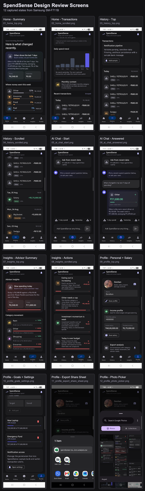

# SpendSense Design Review

SpendSense is a personal finance assistant that turns local transaction data into daily spend guidance, advisor-style insights, goals, and AI chat.

## Review Board

The stitched design board is available at:

## Captured Screens

| Screen | Scenario | File |
| --- | --- | --- |
| Home | Summary of recent spend and weekly category pressure | `screenshots/design-review/01_home_top.png` |
| Home | Daily trend, monthly context, grouped recent transactions | `screenshots/design-review/02_home_scrolled.png` |
| History | Transaction pipeline and current-day transactions | `screenshots/design-review/03_history_top.png` |
| History | Older grouped transaction history | `screenshots/design-review/04_history_scrolled.png` |
| AI Chat | Starting state with suggested questions | `screenshots/design-review/05_ai_chat_start.png` |
| AI Chat | Precomputed answer with visual finance card | `screenshots/design-review/06_ai_chat_answered.png` |
| Insights | Advisor summary and category movement | `screenshots/design-review/07_insights_top.png` |
| Insights | Prioritized advisor action cards | `screenshots/design-review/08_insights_scrolled.png` |
| Profile | Personal profile, salary, and export entry point | `screenshots/design-review/09_profile_top.png` |
| Profile | Goal creation, goal progress, and settings | `screenshots/design-review/10_profile_goals_settings.png` |
| Profile | Export share sheet for Excel-compatible CSV | `screenshots/design-review/11_profile_export_share_sheet.png` |
| Profile | Profile photo picker flow | `screenshots/design-review/12_profile_photo_picker.png` |

## Product Structure

- Home should answer: what changed recently, where money is going, and how it affects the active goal.
- History should make captured transactions auditable with category, merchant, confidence, and grouped dates.
- AI Chat should support natural questions while also offering fast precomputed finance questions.
- Insights should behave like a financial advisor: fewer graphs, stronger signals, and clear next actions.
- Profile is the control center for personal data, salary, goals, export, notification settings, and account controls.

## Architecture Notes

- Domain layer owns financial models, analytics, planning, and export calculations.
- Data layer owns Room persistence, notification ingestion, local profile storage, LLM routing, and file sharing.
- Presentation layer owns Compose screens and view-specific formatting.
- Core contains shared utilities and presentation helpers.

## Export

Profile export generates an Excel-compatible CSV containing:

- transaction date, type, status, merchant, category, amount, and account suffix
- category share of total expenses
- current 7-day and previous 7-day category spend
- trend direction
- advisor note for each transaction category

## Current Design Risks

- The bundled local model makes debug APK packaging and install slow.
- Profile logout is a placeholder until cloud authentication is added.
- Screenshots are from a Samsung SM-F711B device at 1080 x 2640, so tablet and small-device review still needs coverage.
